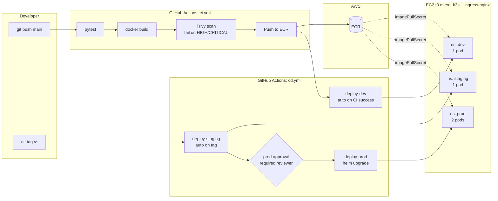
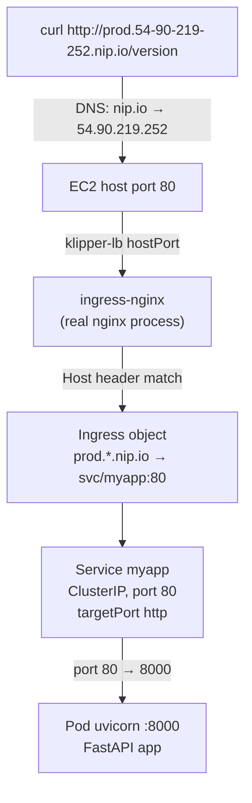

# Multi-Environment CI/CD Pipeline

A production-style CI/CD pipeline that builds, tests, scans, and publishes a Docker image, then promotes it through **dev → staging → prod** Kubernetes environments via Helm — with a manual approval gate before production.

## Live demo

The same image is deployed to three environments on a single-node k3s cluster on AWS EC2. Each environment has its own ingress hostname, replica count, and `ENVIRONMENT` value.

```bash
curl http://dev.54-90-219-252.nip.io/version
curl http://staging.54-90-219-252.nip.io/version
curl http://prod.54-90-219-252.nip.io/version
```

> `nip.io` is a free DNS service that resolves any `<anything>.<ip-with-dashes>.nip.io` to that IP. No DNS records needed.

## Architecture



## Request path (runtime)



## Stack

| Layer        | Tool                                                      |
|--------------|-----------------------------------------------------------|
| Application  | Python 3.12, FastAPI                                      |
| Container    | Docker (multi-stage, non-root UID 10001)                  |
| Registry     | AWS ECR (private, tag immutability on)                    |
| Orchestrator | Kubernetes — `kind` for local, `k3s` on EC2 t3.micro for live |
| Ingress      | ingress-nginx                                             |
| Packaging    | Helm chart (one chart, three values files)                |
| CI/CD        | GitHub Actions                                            |
| Auth (CI→AWS)| OIDC federation (no long-lived AWS keys)                  |
| Security     | Trivy image scan (gates the build on HIGH/CRITICAL CVEs)  |

## What this project demonstrates

- **CI gating, not just CI reporting** — Trivy fails the pipeline on fixable HIGH/CRITICAL CVEs. Vulnerable images cannot reach the registry.
- **Short-lived credentials over secrets** — GitHub Actions assumes an AWS IAM role via OIDC. No `AWS_SECRET_ACCESS_KEY` stored anywhere.
- **Immutable image tags** — every image tagged with the 7-char git SHA; combined with ECR tag immutability, no version of any image is ever silently overwritten.
- **One Helm chart, multiple environments** — `values-{dev,staging,prod}.yaml` override only what differs (replicas, resources, ingress host, env vars). Default `values.yaml` works on local kind unchanged.
- **Multi-namespace coexistence on one cluster** — three Helm releases of the same chart in three namespaces, each isolated.
- **Manual approval gate for prod** — uses GitHub Environments + required reviewers. Staging deploys automatically; prod waits for human click.
- **Atomic deploys with rollback on failure** — `helm upgrade --atomic --wait` rolls back the release if any pod fails its readiness probe.
- **ECR auth refreshed per deploy** — short-lived ECR tokens injected as a `docker-registry` Secret in each namespace before each Helm upgrade.

## Triggers and flow

| Event                  | What runs                                                        |
|------------------------|-----------------------------------------------------------------|
| `push` to `main`       | CI: tests → build → scan → push to ECR. CD: auto-deploy to dev. |
| Pull request to `main` | CI: tests → build → scan only. **No push, no deploy.**          |
| `git tag v*` push      | CD: deploy to staging → wait for approval → deploy to prod.     |

## Project layout

```
multi-env-cicd-pipeline/
├── app/                       # FastAPI app
│   └── main.py
├── tests/                     # pytest
├── Dockerfile                 # multi-stage, non-root
├── chart/                     # Helm chart
│   ├── Chart.yaml
│   ├── values.yaml            # defaults (works on local kind)
│   ├── values-dev.yaml        # per-env overrides
│   ├── values-staging.yaml
│   ├── values-prod.yaml
│   └── templates/
│       ├── _helpers.tpl
│       ├── deployment.yaml
│       ├── service.yaml
│       └── ingress.yaml
├── infra/
│   └── kind-config.yaml       # local kind cluster setup
├── .github/workflows/
│   ├── ci.yml                 # test, build, scan, push to ECR
│   └── cd.yml                 # deploy dev/staging/prod with approval
├── requirements.txt
├── requirements-dev.txt
└── README.md
```

## Run locally (kind)

```bash
# 1. Cluster
kind create cluster --name multi-env-cicd --config infra/kind-config.yaml
kubectl apply -f https://raw.githubusercontent.com/kubernetes/ingress-nginx/main/deploy/static/provider/kind/deploy.yaml
kubectl wait --namespace ingress-nginx --for=condition=available --timeout=180s deployment/ingress-nginx-controller

# 2. Build and load
docker build \
  --build-arg APP_VERSION=0.1.0 \
  --build-arg GIT_SHA=$(git rev-parse --short HEAD) \
  -t multi-env-cicd-pipeline:dev .
kind load docker-image multi-env-cicd-pipeline:dev --name multi-env-cicd

# 3. Install all three environments
for env in dev staging prod; do
  helm upgrade --install myapp ./chart \
    -f chart/values-$env.yaml \
    -n $env --create-namespace --wait
done

# 4. Hit each
curl -H "Host: dev.myapp.local"     http://localhost:8080/version
curl -H "Host: staging.myapp.local" http://localhost:8080/version
curl -H "Host: prod.myapp.local"    http://localhost:8080/version
```

## Run tests

```bash
python3 -m venv .venv
source .venv/bin/activate
pip install -r requirements-dev.txt
pytest -v
```

## Security choices worth calling out

- **OIDC, not access keys** — IAM role trusts `repo:Aryan-juneja/multi-env-cicd-pipeline:*` via the `token.actions.githubusercontent.com` OIDC provider. `StringLike` condition on `sub` claim restricts assumption to this specific repo.
- **Container runs as UID 10001, non-root** — passes Kubernetes restricted PodSecurityStandard.
- **`drop: ALL` capabilities, `allowPrivilegeEscalation: false`** in the Deployment.
- **Tag immutability on ECR** — once pushed, `:abc1234` can never be overwritten with different content.
- **Image pull secrets refreshed every deploy** — ECR auth tokens expire every 12 hours; we don't rely on long-lived ones.

## Lessons learned during build

**CVE-2024-47874 (HIGH, starlette DoS)** — Trivy's first scan caught a fixed transitive vulnerability in `starlette 0.38.6`, pinned by `fastapi==0.115.0`. Couldn't bump starlette directly because fastapi 0.115's metadata pinned `starlette<0.39.0`. Fix: bump to `fastapi==0.128.8`, which allows `starlette<1.0,>=0.40.0` and pulled in patched 0.49.x. Pipeline went green on the next push. This is the entire point of having a gating scanner in CI — you find these *before* they ship.

**t3.micro memory pressure** — first staging deploy crashed the k3s API server. Total inventory: k3s 416 MB + ingress 100 MB + system 200 MB + pods ≈ 65 MB free on a 1 GiB host. Fix was twofold: (1) add 2 GiB swap with `vm.swappiness=10` so the kernel only swaps under real pressure, (2) right-size replicas to 1/1/2 instead of 1/2/3. Free tier sizing has hard limits — don't pretend otherwise.

## Roadmap

- [x] Phase 1 — FastAPI app with `/`, `/health`, `/version` + tests
- [x] Phase 2 — Multi-stage Dockerfile, non-root user (UID 10001), `.dockerignore`
- [x] Phase 3 — Raw Kubernetes manifests + local `kind` cluster + ingress-nginx
- [x] Phase 4 — Helm chart with `values-{dev,staging,prod}.yaml`, three releases on one cluster
- [x] Phase 5 — GitHub Actions CI: pytest, build, Trivy scan, push to AWS ECR via OIDC
- [x] Phase 6 — GitHub Actions CD: auto-deploy to dev on main, tag-driven staging then prod with required-reviewer approval gate
- [x] Phase 6.5 — k3s on AWS EC2 t3.micro (free tier), three namespaces, ingress-nginx, 2 GiB swap
- [x] Phase 7 — Polish: architecture diagrams, public demo URLs via nip.io
